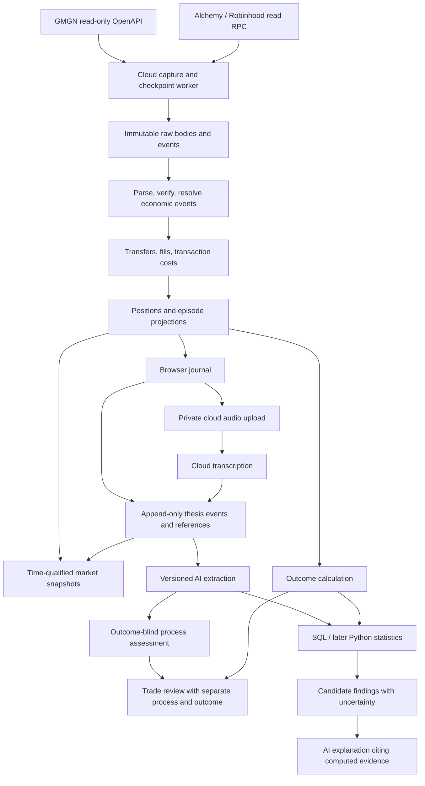
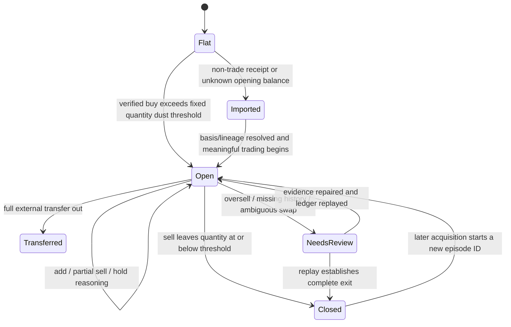
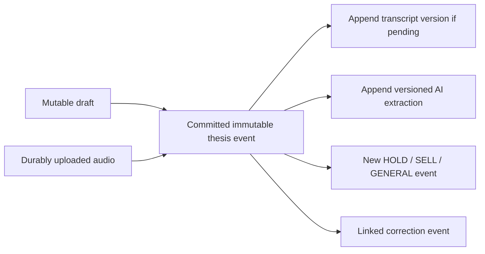

# Robinhood Chain Trading Journal — Architecture and Implementation Plan

Research date: **2026-09-10**. Initial user: one trader, initially one wallet. This document is a design and implementation plan for a private personal MVP. The first Vercel-compatible journal shell is now being built; cloud synchronization remains separate work.

**Subsequent Phase 1 update, same date:** the read-only harness is now implemented and authenticated. See [PHASE1_RESULTS.md](PHASE1_RESULTS.md) for the live evidence and HYBRID_REQUIRED gate. Statements below about missing credentials describe the original research stage; the results document supersedes those input/access unknowns. Phase 2 remains closed.

## 1. Recommendation and release gate

**Latest constraint: $0 recurring cost is mandatory.** See [FREE_IMPLEMENTATION.md](FREE_IMPLEMENTATION.md); it supersedes paid infrastructure and model-service assumptions throughout this original plan. The persistent Railway worker recommendation is withdrawn. The user approved Vercel Hobby for the private personal frontend. Supabase Free Cron/Edge Functions is the backend candidate, with a 15-minute sync and a 30-minute freshness target. See docs/VALIDATION_NEXT_STEPS.md; no cloud deployment has yet been verified.

Use **GMGN activity as the candidate primary trade feed**, Alchemy Free for supported receipt/balance/indexed reads, and a separately validated free trace endpoint for missing native cashflows, with our own versioned position/cost-basis calculations. SolidRPC Free has now returned live call and transaction-state traces on chain 4663; see the results for the bounded sample and remaining gates. Browser work remains limited to rendering, typing, microphone capture, and uploads.

The central object is a **position episode with an append-only thesis timeline**. BUY, HOLD, SELL, GENERAL_THOUGHT, and OPTIONAL_FILL_NOTE are separate event types. Original trader text, original speech transcripts, references, and their true recording times survive every AI reprocessing run. The model never substitutes summaries for the source material.

**Do not present the private MVP as a production ledger until the remaining checks pass.** The user has approved building the personal journal now. Current evidence supports a read-only fixture and incremental live sync; it does **not** establish complete Robinhood wallet history or independent historical USD truth. Unknown fields stay visible in the UI rather than becoming guessed values.

Three important design consequences:

1. GMGN's CLI accepts Robinhood, but support in code and documentation is not proof of backend completeness.
2. `gmgn-cli --raw` is not a byte-preserving HTTP archive: version 1.6.1 unwraps the API envelope and sanitizes strings before output. Save the HTTP body independently, then parse/display safely.
3. An entry snapshot fetched after a trade is detected is **post-execution context**. It must not silently become information available before the trade. Store the time distinction explicitly.

## 2. Evidence method, versions, and source record

Evidence labels throughout:

- **LIVE:** an actual read-only network response obtained in this research.
- **LOCAL:** behavior executed from the published CLI package with synthetic input or mocked network transport.
- **DOC/CODE:** documented or inspected implementation; backend behavior remains unverified.
- **UNKNOWN:** not established. An implementation task or acceptance test is specified instead of an invented answer.
- **DESIGN:** a proposed application rule, not a provider guarantee.

Official sources were searched and opened. Public source files, package metadata, selected package code, and probe responses are saved under `research/`. Full current GMGN skill documents were downloaded as evidence, not installed as agent instructions. The workspace was empty apart from Git metadata; no application or local GMGN configuration was present.

Pinned evidence:

| Item | Observed version / identifier |
|---|---|
| GMGN repository | `GMGNAI/gmgn-skills` |
| Repository main commit | `ec95135ecabfdf617c0690a28af64e84d22d5210`, commit timestamp `2026-09-10T09:17:27Z` |
| npm latest at research time | `gmgn-cli@1.6.1` |
| Published package SHA-1 | `5d7c1269475615a3ee3f10f62fdf332664ff1f8d` |
| Package integrity | SHA-512 verified against npm metadata before local source tests |
| Research Node runtime | `v24.14.0` |
| Mainnet identity | decimal `4663`, hexadecimal `0x1237`; ETH gas asset |

The repository README was fetched at the pinned commit. Other downloaded repository documents were fetched from main during this research; their saved bytes and SHA-256 manifest identify the exact evidence even if main later changes. The npm artifact and its integrity are a separate version boundary. [Official repository](https://github.com/GMGNAI/gmgn-skills), [published package metadata](https://registry.npmjs.org/gmgn-cli/1.6.1).

### 2.1 Conflicting or stale documentation

| Conflict | Evidence | Resolution for this project |
|---|---|---|
| Older Agent API chain table lists SOL/BSC/Base; current code accepts Robinhood | Agent overview versus current portfolio/token/market documents and CLI validator | Prefer the pinned implementation for command compatibility; require a live backend test for capability. |
| Old Q&A says there is no open data API | Q&A versus current Agent API and published CLI | Treat Q&A as stale for the Agent OpenAPI route; do not build a website scraper. |
| Broad overview says portfolio queries need only an API key; detailed route signs holdings | CLI `getWalletHoldings()` versus `getWalletActivity()` | Omit holdings. Reconstruct inventory and call public-chain balances or API-key token-balance. |
| Old CLI usage lists fewer chains and generic `transfer`; current code lists `transferIn` / `transferOut` | Saved `docs/cli-usage.md`, portfolio skill, CLI command source | Treat accepted CLI options and actual returned fields separately; never assume liquidity `add/remove` means scaling a trade. |
| Portfolio document contains old examples/options that its later correction disavows | `--sell-out`, `cost`, `profit_change` versus updated holdings section | Do not reuse examples as schema. Holdings is excluded anyway. |
| Demo README says Robinhood signals/KOL feeds unsupported | Older official `skillmarket-demos` example versus current README/market skill | Current docs claim expanded support. These optional feeds stay unverified and outside V1. |
| K-line examples imply bare arrays; current field reference describes `list` | Market document examples versus response reference | Inspect the transport envelope and retain both raw body and parsed shape. |
| Alchemy mainnet announcement retains testnet onboarding instructions | Mainnet blog versus Robinhood connecting guide and Alchemy mainnet resource page | Use mainnet URL and verify `eth_chainId`; never silently connect to 46630. |
| Documented CLI automatic 429 retry versus local behavior | CLI 1.6.1 synthetic short-cooldown 429 test returned after one fetch; inspected async parsing bypasses the surrounding synchronous catch | Own the retry/cooldown policy in the provider transport; do not rely on CLI retries. |
| Broad Alchemy platform support versus method/category support | Robinhood resource page, Transfers API reference, webhook reference | Test each enhanced API separately. Webhook internal-transfer support does not prove identical historical Transfers API coverage. |

The older Agent API and Q&A pages are useful evidence of drift, not integration contracts. [Agent API](https://docs.gmgn.ai/index/gmgn-agent-api), [GMGN Q&A](https://docs.gmgn.ai/index/q-a), [CLI usage](https://github.com/GMGNAI/gmgn-skills/blob/main/docs/cli-usage.md), [official demo](https://github.com/GMGNAI/skillmarket-demos/blob/main/aitrader/README.en.md), [Alchemy announcement](https://www.alchemy.com/blog/robinhood-chain-mainnet-is-live-on-alchemy).

## 3. GMGN capability matrix for Robinhood

**None of the GMGN data capabilities below has an authenticated LIVE pass in this research.** The current published client supports the listed read methods without a signature. Auth is `X-APIKEY` plus request `timestamp` and a fresh `client_id`; the inspected client builds these parameters. Do not copy authentication secrets into URLs or logs. Source comments indicate tight clock tolerance; verify server behavior and keep the worker clock synchronized.

Base URL: `https://openapi.gmgn.ai`. Table weights are documented values, **not measured account entitlements**.

| Capability / CLI | HTTP route | Auth / weight | Robinhood evidence | V1 decision |
|---|---|---|---|---|
| `portfolio activity` | GET `/v1/user/wallet_activity` | API key / 3 | DOC, CODE, LOCAL request construction; unauthenticated LIVE 401 | Candidate primary ingestion |
| `portfolio token-balance` | GET `/v1/user/wallet_token_balance` | API key / 1 | DOC/CODE | Optional inventory comparison |
| `portfolio stats` | GET `/v1/user/wallet_stats` | API key / 3 | DOC/CODE; official demo reports past live tests | Store provider comparison, never canonical P&L |
| `portfolio profits` | POST `/v1/user/wallet_profits` | API key / 3 | DOC/CODE | Optional later aggregate comparison |
| `portfolio created-tokens` | GET `/v1/user/created_tokens` | API key / 2 | DOC; demo reports past test | Optional later developer context |
| `portfolio info` | GET `/v1/user/info` | API key / 1 | DOC/CODE; account-specific | Unnecessary; use explicit watch addresses |
| `portfolio holdings` | GET `/v1/user/wallet_holdings` | Signature required / 5 | DOC/CODE | **Excluded** |
| `token info` | GET `/v1/token/info` | API key / 1 | DOC/CODE; demo reports past test | Core metadata/snapshot probe |
| `token security` | GET `/v1/token/security` | API key / 1 | DOC/CODE | Optional fields, retain unknowns |
| `token pool` | GET `/v1/token/pool_info` | API key / 1 | DOC/CODE | Pool/quote/liquidity evidence |
| `token holders` | GET `/v1/market/token_top_holders` | API key / 5 | DOC/CODE | Sample in research; not per-fill polling |
| `token traders` | GET `/v1/market/token_top_traders` | API key / 5 | DOC/CODE | Defer |
| `market kline` | GET `/v1/market/token_kline` | API key / 2 | DOC/CODE | Probe history, coverage, USD units |
| `market trending` | GET `/v1/market/rank` | API key / 1 | DOC/CODE; demo reports past test | Not needed to journal own trades |
| `market signal` | POST `/v1/market/token_signal` | API key / 3 | Current DOC/CODE contradict older demo | Defer |
| Trading, approvals, order management, signed follow-wallet | Various | Signing / trading surface | Not needed | Never expose in journal |

Route and auth evidence: [portfolio reference](https://github.com/GMGNAI/gmgn-skills/blob/main/skills/gmgn-portfolio/SKILL.md), [token reference](https://github.com/GMGNAI/gmgn-skills/blob/main/skills/gmgn-token/SKILL.md), [market reference](https://github.com/GMGNAI/gmgn-skills/blob/main/skills/gmgn-market/SKILL.md), and saved `research/sources/cli-1.6.1/dist/client/OpenApiClient.js` from the [versioned npm artifact](https://registry.npmjs.org/gmgn-cli/-/gmgn-cli-1.6.1.tgz).

### 3.1 Candidate activity contract — must be replaced by fixture evidence

The documented CLI payload is `{ activities: [...], next: ... }`; the HTTP client expects a successful API envelope and returns its `data`. This is a parser hypothesis, not the exact observed Robinhood row schema.

| Candidate field | Intended interpretation | Validation requirement |
|---|---|---|
| `tx_hash` | Transaction identity | Missing hash quarantines economic row; hash alone cannot identify a fill |
| `event_type` or `type` | Activity classifier | Observe actual enum; no guessed mapping for unknown values |
| `token.address`, `token.symbol` | Token identity/display | Chain + contract is identity; symbol is untrusted display text |
| `token_amount` | Reported quantity | Verify decimals, signedness, human units, transfer taxes, rounding |
| `cost_usd` | Reported trade USD notional | Determine gross/net fee inclusion against quote movement |
| `buy_cost_usd` | Provider assigned basis on a sell | Comparison only; not journal basis |
| `price` | Quote-denominated execution price | Preserve quote identity; never label as USD |
| `price_usd` | Reported execution USD price | Compare to `cost_usd / quantity`, then independent valuation |
| `timestamp` | Reported transaction Unix time | Check seconds and compare block; keep ingestion time separately |
| `gas_usd`, `priority_fee`, `tip_fee` | Provider friction fields | Units and overlap unresolved; never sum blindly |
| `launchpad_platform` | Provider launchpad label | Optional and time-scoped |
| `next` on page | Cursor | Opaque value, terminate only per observed protocol |

Do not replace absent fields with zero. Preserve extra fields. Derive a schema fingerprint per page and a field/type/null-frequency profile for the validation run. A changed payload for a previously seen source event becomes a new raw revision.

### 3.2 Networking and rate limits

Current official Agent documentation explicitly says IPv4 only. The unauthenticated probe reached the API over IPv4; an authenticated IPv4 success and an IPv6 comparison were **not** established. Use an IPv4 transport in the cloud and test there. Do not change the trader's machine network configuration. [GMGN Agent API](https://docs.gmgn.ai/index/gmgn-agent-api).

Current route docs describe a weight-based bucket with rate/capacity 20. At weight 3 that would imply approximately 6.67 activity requests/second and a full-bucket burst of six **if that policy applies to the account**. A 15-minute sync for one personal wallet is far below that theoretical rate before pagination/snapshots. Start conservatively, maintain one global budget per key, and measure headers/entitlements rather than load-testing to a ban. Respect `Retry-After`, `X-RateLimit-Reset`, and body `reset_at`; honor the latest applicable cooldown. No requests from another job may bypass that pause. [Rate-limit implementation reference](https://github.com/GMGNAI/gmgn-skills/blob/main/docs/cli-usage.md).

## 4. Live and local research tests

All network calls were read-only. No account was created, no wallet connected, no key generated, and no trade/signature submitted. The temporary CLI artifact was inspected; the full CLI command was not run against authenticated wallet data.

| Test | Result | What it establishes |
|---|---|---|
| Public Robinhood JSON-RPC: chain ID + head | HTTP 200; `0x1237`; head `0x38e24d7` = 59,647,191 | Mainnet read endpoint reachable from research host |
| Read that block with transaction objects | HTTP 200; 102 transactions; block time `2026-09-10T19:18:09Z` | Public transaction details available |
| First three ordinary transaction receipts | HTTP 200; all three failed, nonzero gas, no logs | Failed attempts must not become fills; costs still exist |
| Ten additional receipts spread through same block | Nine failed; one successful with one log | Receipt status/log access works; this is not a representative trading sample |
| `safe` and `finalized` block tags | Both returned blocks | Tags accepted by this public endpoint; confirmation semantics still follow chain documentation |
| GMGN activity route without key, zero address | HTTP 401, `AUTH_INVALID`; missing key/client identifier | Authentication boundary reachable, not evidence of Robinhood data support |
| Alchemy documented `docs-demo` chain ID | HTTP 403; origin not on whitelist | Demo not usable here. Does not disprove authenticated Alchemy support |
| Blockscout public transactions API | HTTP 403 browser challenge | Explorer API unavailable from this probe; no attempted bypass |
| CLI 1.6.1 Robinhood and EVM-address validation | LOCAL pass | Validator accepts Robinhood |
| CLI activity request with mocked fetch, no private key | LOCAL pass; GET path, wallet/chain query, API-key header | Client constructs activity request without signing |
| CLI 429 with a synthetic short cooldown | LOCAL one request then rejection; no automatic retry observed | Journal must own its rate-limit policy |
| CLI sanitizer with synthetic zero-width symbol | LOCAL changed `T[zero-width]EST` to `TEST` | CLI output transformation exists, including raw-output path |

Latency values of roughly 0.15–0.22 seconds in saved curl observations are **HTTP round-trip samples only**, not trade ingestion latency or a production SLA. The chain sample contains 13 ordinary receipts but is **not** the requested 10–30 transaction GMGN-to-chain validation dataset. Its addresses are not represented as known meme-coin traders.

Evidence files: `research/probes/robinhood-rpc.json`, `robinhood-block.json`, `robinhood-receipts-finality.json`, `receipt-sample.json`, `gmgn-unauthenticated.json`, `alchemy-demo.json`, `blockscout-transactions.json`, `cli-local-tests.json`, and `cli-rate-limit-local-test.json`. HTTP headers and the ten-receipt request are saved alongside them.

## 5. Explicit answers to the 25 research questions

| # | Question | Current answer / next decisive test |
|---|---|---|
| 1 | Does `portfolio activity --chain robinhood` work? | Current 1.6.1 validator and read client support it; official demo reports prior successes. **Authenticated live success here: unknown.** Run on supplied wallet/key. |
| 2 | All wallet activity or GMGN only? | Unknown. Compare unfiltered pages to chain-derived inventory and independently identified external trades. An endpoint accepting arbitrary wallets does not prove complete coverage. |
| 3 | How far back? | No verified retention bound. Walk to end; compare oldest independently known activity. Separate wallet inception, provider retention, page cap, and archive availability. |
| 4 | Complete pagination? | Cursor protocol documented; completeness unverified. Compare overlapping page sizes, repeated crawls, and independent expected hashes, including new arrivals during traversal. |
| 5 | Real latency? | Unknown. During ordinary live trading, timestamp first RPC receipt observation, last GMGN absence, first GMGN presence, and DB availability. Report p50/p95/max and polling uncertainty. |
| 6 | Exact schema? | No authenticated Robinhood schema obtained. Candidate contract in §3.1; profile real raw response fields before normalizer. |
| 7 | Multiple activity events per transaction? | GMGN behavior unknown. Schema permits many events/fills per hash. Inspect routes/multicalls; preserve log/leg identity. |
| 8 | Correct partial buys/sells? | Unknown. Verify each delta and final balances for scale-in/out episodes. |
| 9 | Historical USD accuracy? | Documented USD fields, unverified values. Compare quote flows and historical quote/USD conversion; provider self-consistency alone is insufficient. |
| 10 | Which endpoints are API-key-only? | Candidate read allowlist in §3, supported by inspected client methods. Holdings is a signed exception. |
| 11 | Entire journal read-only? | **Yes by architecture.** Public addresses and read-only provider access suffice for core ledger reconstruction; some quotes/history may remain unavailable. No wallet signing, trading keys, or approvals. API enrollment may request a separate asymmetric public key; do not conflate that with a wallet key or install its private counterpart in the journal. |
| 12 | Current rate limits? | Route docs: 20 weight/sec, capacity 20; activity weight 3. Actual key/plan limit, monthly quota, and shared scope need verification. |
| 13 | IPv4 mandatory? | Current docs explicitly say yes. IPv4 route reached; authenticated behavior and worker deployment still need testing. |
| 14 | Robinhood market metrics? | Current token/market docs claim coverage; field-level matrix in §12. All optional metrics need token-specific live coverage checks. |
| 15 | Historical K-lines? | Documented with explicit ranges/resolutions; oldest date, gaps, pool selection, delisted-token retention and request caps unknown. |
| 16 | Holders/top holders? | Documented endpoints and aggregate fields; current/past coverage unverified. Historical concentration cannot be assumed. |
| 17 | Smart-money/sniper/bundle? | Documented snapshot labels/counts. Feed support changed across docs. Availability/accuracy on Robinhood unknown; defer causal use. |
| 18 | Token creation time? | Documented token creation field; distinguish deployment from first pool/trading time. Validate timestamps and retain both. |
| 19 | Entry market cap/liquidity? | Can request upon detection if metrics exist. Exact entry-time liquidity/history not guaranteed. Market cap may need price × contemporaneous circulating supply; do not substitute current supply historically. |
| 20 | What requires RPC/Alchemy? | Receipt existence/status, ordering, logs, raw token movements, balances, gas, finality, missing-activity discovery and known-route recovery. Historical USD needs a price source in addition to RPC. |
| 21 | Can Alchemy cheaply fill gaps? | Likely at this scale if enhanced-method coverage passes. Mainnet product directory lists Transfers; demo blocked. §17 estimates CU. Transfers identify movements, not a fully decoded trade or historical USD amount. |
| 22 | Canonical P&L? | Versioned journal weighted-average ledger, using verified quantities and explicitly sourced valuations; GMGN P&L remains comparison data. |
| 23 | What can stay free? | Vercel Hobby for this private personal frontend, Supabase Free for a modest database/sync workload, SolidRPC Free for bounded traces and Alchemy Free for supported reads. The personal-use condition is accepted for this MVP. |
| 24 | Unavoidable monthly costs? | For proposed production stack: persistent worker and managed DB budget; paid web tier if using Vercel professionally; variable AI/audio. GMGN plan price/quotas unresolved, so no honest all-in fixed total. §17 gives scenarios. |
| 25 | What does V1 defer? | Broad pattern claims, advanced session models, exhaustive holder/smart-money history, general DEX indexing, cross-chain accounting, tax reports, trading, social scraping, vector search, and automatic trade recommendations. |

## 6. Provider architecture and data flow

Use three small implementations behind a capability-aware provider boundary. Unsupported capability must return a typed result, not an empty successful array.

```typescript
// Interface design only. Values are decimal strings or integer strings, never money floats.
interface TradeDataProvider {
  capabilities(chainId: number): Promise<CapabilityReport>;
  fetchActivityPage(input: ActivityPageRequest): Promise<CapturedActivityPage>;
  fetchMarketSnapshot(input: SnapshotRequest): Promise<CapturedSnapshot>;
  fetchCandles(input: CandleRequest): Promise<CapturedCandles>;
  fetchTransaction(input: ChainTransactionRequest): Promise<CapturedTransaction>;
  fetchBalance(input: BalanceRequest): Promise<CapturedBalance>;
}
```

`GMGNProvider`: owns HTTP auth, throttling, raw-body capture, envelopes and parser versions. `AlchemyProvider`: enhanced wallet discovery when verified, standard RPC, optional webhook reception. `RobinhoodRPCProvider`: standard RPC over configured public/backup endpoint; no assumption of indexed wallet history. Implement shared code by composition, not by pretending all three provide every method. Keep authentication, parsing, normalization, and economic resolution distinct.

Every result carries provider, chain, request ID, captured response reference, observed time, coverage, completeness state and warnings. Normalization produces **candidate events**; a resolver combines evidence into one economic ledger. Provider substitution cannot duplicate the same fill or charge gas twice.



No live trading connection is needed. Adding a watch address is an account setting, not a wallet-connect/sign-message flow.

## 7. Cloud architecture and likely project layout

One repository, two deployed processes, one managed database:

- **Web:** Next.js, TypeScript, Vercel Pro for the production budget; server routes authenticate writes and issue short-lived audio upload URLs. Browser receives compact episode/timeline updates through Supabase Realtime and resyncs after reconnect.
- **Worker:** one Railway service, Node 24 LTS candidate subject to Phase 1 runtime check, small bounded concurrency. Ingestion has priority over enrichment, transcription, and AI. All external calls are asynchronous; heavy later statistics run off-peak or in a subprocess.
- **Postgres:** Supabase, SQL migrations, decimal amounts, tenant ownership, RLS, append-only source tables and rebuildable projections. A `jobs` table with leased rows and `FOR UPDATE SKIP LOCKED` avoids a separate queue service.
- **Storage:** private Supabase buckets for compressed raw bodies, audio and exports. Postgres holds searchable metadata and hashes. Never depend on worker filesystem durability.
- **Secrets:** worker receives GMGN/API and RPC secrets; separate AI key scoped to project. Web never receives GMGN credentials. No signing component in production dependency/API surface.

Railway documents outbound IPv4 with IPv6 disabled by default. Keep that default for GMGN. Supabase direct database connections normally use IPv6; use its IPv4-compatible **session pooler** for the persistent worker and transaction pooler for short serverless operations. This avoids buying an IPv4 database add-on just for compatibility. Verify migrations, TLS, prepared-statement behavior and connection limits on the chosen route. [Railway networking](https://docs.railway.com/networking/outbound-networking), [Supabase connections](https://supabase.com/docs/guides/database/connecting-to-postgres).

Before deployment choice is considered final, run a cloud smoke test for authenticated GMGN IPv4, RPC chain ID, DB reads/writes, object uploads, clock skew, restart recovery, and process memory. This research did not provision a worker or test cloud egress. If stable egress allowlisting is required by the actual GMGN key, choose a plan with static outbound IP or another host; a shared IPv4 route alone does not satisfy a static-IP requirement.

```text
apps/web/                         # journal, auth, API routes
apps/worker/src/                  # scheduler, leases, provider jobs
packages/providers/src/           # contracts, gmgn, alchemy, robinhood-rpc
packages/ledger/src/              # normalization, resolution, costs, episodes
packages/journal/src/             # immutable events, references, temporal rules
packages/analytics/src/           # features, cohorts, metrics, SQL
packages/ai/src/                  # provider interface, extraction, review schemas
packages/db/                     # queries and transaction helpers
supabase/migrations/             # phase-specific SQL only when implemented
scripts/phase1/                  # bounded probe and validation harness
fixtures/                        # synthetic and sanitized public fixtures, labeled
research/                        # evidence, manifests, capability reports
ops/                             # Dockerfile, runbooks, restore procedures
```

Use ordinary TypeScript modules and a small package workspace. No Kafka, Kubernetes, independently deployed AI microservices, vector database, or custom chain-wide indexer.

## 8. Database schema and invariants

This is the target logical schema, implemented incrementally. Phase 1 uses files, not all these tables. Do not create future analytics tables merely because they appear here.

Common types: UUID IDs, `timestamptz` in UTC, chain IDs as integers, EVM addresses normalized to lowercase 20-byte identity plus optional checksum display, transaction/block hashes as 32-byte values or validated hex. Raw uint256 quantities use `numeric(78,0)`; human quantities and USD amounts use unconstrained Postgres `numeric` with application precision checks (rather than a fixed scale that rounds tiny meme-token prices). Use arbitrary-precision decimal math in TypeScript. Store original source numeric strings and raw body bytes; parsing JSON into binary floating-point first can already lose information.

All private entities carry `user_id`. Parent/child joins must enforce the same owner via composite foreign keys or checked server transactions; RLS alone is not a substitute for referential integrity. Shared token metadata is public only if explicitly separated from wallet ownership and journal data.

### 8.1 Identity, source, and synchronization tables

| Table | Essential columns / constraints |
|---|---|
| `users` | `id` → auth user, timezone, preferences, created_at; timezone defaults to America/Los_Angeles |
| `wallets` | id, user_id, chain_id, normalized_address, label, watch_from, verified_history_from, active; unique owner/chain/address |
| `tokens` | id, chain_id, normalized_address or explicit native-asset key, decimals nullable, symbol/display metadata, provenance; unique chain/asset key |
| `provider_responses` | id, provider, endpoint, request_fingerprint, redacted request metadata, requested_at, received_at, HTTP status, safe response headers, exact body SHA-256, body storage location or bytes, content_type, schema fingerprint, client/provider version, byte length |
| `raw_provider_events` | id, response_id, provider, chain_id, wallet_id, provider_event_id nullable, tx_hash nullable, source_row_pointer/ordinal, raw JSON, payload hash, ingested_at; unique response/row pointer |
| `raw_chain_events` | id, response_id, chain_id, block_number/hash, tx_hash, tx_index, log_index/trace_path nullable, event_kind, raw JSON, observed_at; retain competing block versions |
| `raw_market_responses` | View over provider_responses tagged as market requests; immutable original response references |
| `raw_gmgn_events` | View over raw_provider_events where provider = GMGN; no duplicate source store |
| `sync_state` | owner/wallet/provider/stream key, recent cursor, history cursor, bounded scan range, last committed response, covered_through_block, observed_head, last_success_at, next_poll_at, lease owner/expiry, generation/version |
| `provider_health` | provider/chain/credential scope, last_success, latency distributions, consecutive errors, cooldown_until, newest source event, last head, last checked_at, parser error count |
| `jobs` | id, type, payload/ref, idempotency_key unique, priority, state, available_at, lease expiry, attempt count, error code; no sensitive original text in routine logs |
| `ingestion_issues` | owner, source refs, severity, category, first/last seen, affected token/episode, resolution state; original evidence remains retained |

Capture a raw response durably **before** advancing its ingestion checkpoint. Do not block raw checkpoint progress on one malformed row: durably quarantine it and create a retry task, then record the economic coverage gap separately. Raw-fetch progress and normalized-ledger completeness are different states.

Identical body bytes may share a content-addressed object; retain every response observation and every row pointer. If upstream envelopes change per request, compress and archive all bodies; do not discard payloads solely to fit a free plan. Secrets and authorization headers are not source trading data and must never be archived.

### 8.2 Economic ledger and projections

| Table | Essential columns / constraints |
|---|---|
| `chain_transactions` | chain_id, tx_hash, block/hash/index, block_time, first_seen_at, receipt_status, finality state, payer, raw refs; separate append-only observation/revision history from current verified view |
| `normalized_events` | id, owner, chain/wallet, economic_event_key, event kind, execution ordering key, parser/resolver version, source refs, quality/verification state, supersedes_id; immutable versions |
| `fills` | id, normalized_event_id, side, base token, quote asset, raw/human base quantity, raw/human quote quantity, gross/net notional fields, execution time, tx hash, leg key, venue/pool, valuation reference, verification state, calculation version |
| `fill_sources` | fill/economic event ↔ raw provider/chain evidence; provider observations do not each create a new fill |
| `asset_movements` | normalized event, from/to, asset, raw quantity, movement kind: transfer/airdrop/bridge/wrap/unwrap/rebase/unknown; lot/basis provenance and link to owner transfer pair |
| `transaction_costs` | chain transaction, payer, native gas quantity, USD valuation, cost component, inclusion semantics, source; unique canonical component per tx/payer |
| `fill_cost_allocations` | cost_id, fill_id, allocation amount, method/version; allocations sum to the single transaction cost |
| `positions` | owner/wallet/token current raw quantity, book basis, valuation completeness, dust policy, latest ledger version, last reconciled block; rebuildable projection |
| `position_adjustments` | immutable explicit dust write-off, opening balance, basis correction or confirmed nonstandard-token adjustment; reason, evidence, effective/recorded time |
| `trade_episodes` | stable id, owner/wallet/token, opening event, opened_at, closed_at nullable, close_reason, scope/status, completeness, projection version; financial totals are projections |
| `episode_event_links` | episode ↔ normalized event, generation and assignment reason; preserve reassignment history after replay |
| `episode_lineage` | old/new episode links after split/merge/rebuild; never orphan thesis records |
| `valuations` | subject, native/quote amount, USD rate/notional, price provider/method, price effective time, observed_at, quality, uncertainty, supersedes_id |

A transaction can produce zero, one, or several economic actions. A multi-hop route producing one final token acquisition is usually one economic fill with several chain legs. A multi-buy in one transaction can create fills for multiple tokens. Token-to-token rotation can be a disposal of A plus acquisition of B, linked to one exchange group with costs allocated once.

Identity hierarchy:

1. Prefer verified on-chain log indexes or trace paths plus economic grouping, wallet, chain, transaction and asset.
2. Use a stable upstream event ID if empirically present, reconciled to chain evidence.
3. If neither exists, retain response row ordinals for raw identity, but **do not** use row index, hash alone, or value fingerprint as a claimed stable fill identifier. Two legitimate fills can share every displayed field. Ambiguous multiplicity stays unresolved until receipt/log evidence distinguishes it.

### 8.3 Thesis, voice, and references

| Table | Essential columns / constraints |
|---|---|
| `thesis_events` | id, owner, trade_episode_id, event_type, server written_at, optional client authored_at, effective_at, timing_class, original_text nullable, original_transcript nullable, audio_asset_id nullable, original_content_hash, thesis_status nullable, confidence nullable, confidence_definition_id nullable, correction_of_event_id nullable, supersedes_event_id nullable, idempotency_key |
| `thesis_references` | id, thesis_event_id, original URL, normalized URL, source_type, title_if_known, created_at; one or more per event |
| `fill_notes` | Link table: thesis_event_id unique → OPTIONAL_FILL_NOTE, fill_id; note content exists only in thesis_events |
| `event_relations` | source event, target event, relation: responds_to / invalidates / corrects / elaborates; AI relations stored separately from trader-confirmed links |
| `audio_assets` | owner, private object path, MIME, duration, bytes/hash, recorded_started_at/ended_at, uploaded_at, retention policy, processing state projection |
| `transcript_versions` | audio asset, original provider transcript, provider/model, produced_at, transcript hash, revision lineage; append-only |
| `event_snapshot_links` | event/episode-opening action, snapshot, relation: prior-known / contemporaneous-recording / post-detection / retrospective; assigned_at and rule version |
| `thesis_context_observations` | event, position quantity/value/basis at writing, ledger version used, captured_at, completeness; later ledger correction creates another observation |

Event types are exactly BUY, HOLD, SELL, GENERAL_THOUGHT, OPTIONAL_FILL_NOTE. Status enum is STRONGER, UNCHANGED, WEAKER, INVALIDATED or null; HOLD/SELL expose it as one-click buttons. The UI may label UNCHANGED as “Same.” BUY confidence is optional, not inferred from prose or sentiment.

`written_at` is a trusted server receipt time. `effective_at` is a claimed decision time and can be earlier, but never changes when the writing actually occurred. A retrospective sell explanation may be useful for review but cannot be used as if it predicted the sell. Preserve browser clock time as untrusted metadata. Audio can establish an earlier capture window with explicit provenance; do not use transcription completion time as the decision time.

No mutable `is_ai_processed` column on thesis events: use a job/extraction status view keyed by event content hash, model, prompt and schema version. Otherwise new model runs and failures become indistinguishable.

**Immutability enforcement:** deny UPDATE/DELETE on committed thesis events to application roles and enforce an append-only trigger. Drafts may change before submission. A typo correction or revised transcript creates a linked event/version; the original remains accessible. User-requested account deletion is a separate audited retention operation, not normal editing. Financial projection recalculation cannot change authored text, timing or event identity.

For audio-first saving, create an immutable event referencing the uploaded audio, with text temporarily absent. A later transcript is appended to `transcript_versions` and linked to that event; render through a view. Do not mutate a committed text column to fake “original text at save.” If transcription finishes before save, copy that original transcript into the event and retain the separate provider transcript record.

### 8.4 Market, AI, sessions, and analytics

| Table | Essential columns / constraints |
|---|---|
| `market_snapshots` | id, chain/token/pool/quote, requested_for_time, market_effective_at, observed_at, availability_time nullable, capture_reason, temporal_class, provider response, metrics JSON, metric quality/time provenance |
| `market_candles` | token/pool/source, resolution, interval_start/end, observed_at, finalized_bar flag, OHLCV decimal values, raw ref; revisions retained |
| `trading_sessions` | owner, started_at, ended_at, timezone, definition/version, inferred/explicit, confidence |
| `session_event_context` | event/episode, session_id, computed_as_of, knowledge_cutoff, feature version, timing/exposure/P&L fields and completeness |
| `bankroll_observations` | owner, effective/observed times, assets included, equity estimate, external capital flows, source/completeness; absent denominator means no bankroll percentage |
| `ai_thesis_extractions` | event/content hash, model snapshot, prompt/schema/taxonomy version, knowledge boundary, output JSON, evidence spans, uncertainty, raw response/ref, token usage, created_at |
| `ai_thesis_changes` | from/to event or extraction, assumption changed, new information, impact, action, change type, evidence, model/version; separate from trader status |
| `process_assessments` | episode and decision prefix, cutoff, rubric/version, outcome-blind assessment, evidence IDs, frozen_at |
| `outcome_assessments` | episode/ledger version, deterministic P&L and valuation quality, outcome-only market observations |
| `feature_adjudications` | extraction/feature, original and corrected interpretation, adjudicator, reason, recorded_at; append-only |
| `ai_trade_reviews` | episode/ledger version, process assessment ID, outcome assessment ID, review JSON, evidence refs, model/prompt versions |
| `ai_session_reviews` | session/version, aggregate evidence/finding refs, model/prompt versions, output |
| `analytics_features` | subject, feature name/value, feature version, source extraction/snapshot, temporal role, knowledge cutoff, quality |
| `analytics_results` | run/cohort definition, dataset hash/version, metric values, N/exclusions, uncertainty, multiple-testing family, lookback, generated_at |
| `analytics_findings` | result IDs, evidence strength, limitations, explanation, review state; must point to actual quant output |

Useful indexes: wallet/chain/block order; wallet/token/executed_at; episode/written_at; provider/tx_hash; raw payload hash; due jobs with partial index on queued state; open episodes by owner; event/extraction version. One current open economic episode per scope is enforced in the current projection, while historical revisions remain queryable.

## 9. Position episode state machine

Default scope is **owner + wallet + chain + token**. V1 supports long spot positions; no shorting, derivatives, or collateral bookkeeping. “Position” is the inventory projection; “episode” is the period of economic exposure. State transitions are driven by verified economic actions, not API arrival order or text-event type.



Implementation rules:

- Sort by block number, transaction index and economic leg ordering; then apply deterministic tie rules. Provider timestamp alone is insufficient. If two independent actions share a transaction and their economic order is unresolved, do not manufacture a buy-then-sell sequence.
- Group router hops using **wallet-level net movements and receipt evidence**. Intermediate pool assets are not automatically positions for the trader. Preserve the hops in raw evidence.
- Multiple buys, partial sells, and multiple HOLD events remain in the same episode while inventory exceeds the fixed quantity threshold. A full close followed by a new buy is a fresh episode even for the same ticker on the same day.
- Dust is an asset-specific **quantity** threshold chosen and versioned from token precision and verified operational behavior. Never continuously recompute closure from current USD price: a price crash alone must not close an episode. Use zero until a nonzero rule is justified. Leftover dust remains real inventory in a residual lot; assign it a carrying basis or explicit write-off once, never silently drop it.
- A sell leaving dust can close the active episode while preserving its residual lot. A later buy starts another episode; moving residual quantity/basis into it is a logged carry-in, not a new cost-free acquisition. A later residual-only sale attaches to the residual lot and original episode lineage.
- Incoming transfers/airdrops create inventory, not buys or automatic journal prompts. Unknown-cost inventory is separate from clean acquired lots. Selling it yields proceeds with **unknown P&L**, unless its basis has defensible provenance.
- Transfers between owned wallets preserve basis and link outgoing/incoming movements. Wallet views change; consolidated ownership P&L does not realize. V1 may show separate wallet episodes connected by lineage; consolidated cross-wallet episode inference is deferred.
- Full transfer to an untracked wallet ends wallet custody with `TRANSFERRED_OUT`, not “profitable exit.” Economic outcome remains unresolved. Partial transfers move proportional basis and quantity without sale proceeds.
- Bridges, wraps, liquidity deposits/withdrawals and airdrops are distinct kinds. `add`/`remove` provider events are not assumed to mean adding/reducing a spot position.
- Fee-on-transfer tokens use amounts actually received/debited. Nonstandard rebases, burns and balance drift trigger an adjustment/review path. Never reinterpret an unexplained balance change as a trade.
- A sell larger than verified inventory opens an issue and marks the episode incomplete; never invent a zero-cost initial buy or allow unexplained negative holdings.
- Failed/reverted transactions create no successful fill. Record wallet-paid transaction costs as failed-attempt friction; attach to an episode only where intent has adequate evidence, otherwise to session costs.
- Backfill truncation creates `OPENING_BALANCE_UNKNOWN` inventory at the boundary. Imported ongoing positions are excluded from clean expectancy cohorts until basis is recovered.
- Late events/reorgs invalidate the affected projection generation and replay from an earlier checkpoint. Maintain stable episode IDs where opening anchors remain; otherwise record split/merge lineage and explicit thesis reassignment history.

## 10. Thesis timeline and low-friction UX

A BUY event explains anticipated upside; a HOLD explains continued exposure under new information; a SELL explains reducing/closing; GENERAL_THOUGHT captures observations beyond that immediate action. None is required for every fill. A SELL event can accompany a partial reduction, and a subsequent HOLD can follow. No fill or event is fabricated when the trader skips journaling.

For TGCOINS, preserve the supplied BUY about technology, KOL participation and FOMO monitoring; the optional HOLD at 185k; the SELL about an unobservable creator-claim mechanism; and the developer-quality concern as a separate GENERAL_THOUGHT. Store `https://x.com/buildersdao__` structurally. These are trader beliefs, not verified facts about the token. The textual “150k” remains in original text; auto-captured market cap carries its own timestamp/source and may differ.

UI flow:

1. Cloud discovers a new episode; show token/contract, entry fills, automatically calculated size, opened time, and market context with freshness. Put it in a quiet “Needs buy thesis” queue; never interrupt GMGN trading with a modal.
2. One focused text box, microphone, optional confidence, Save. Keyboard shortcut submits; idempotent request and immediate server acknowledgement. Saved text appears without waiting for AI.
3. Open positions have **Add Hold Thesis** and optional Stronger / Same / Weaker / Invalidated buttons. A status-only HOLD is allowed to keep invalidation recording quick. Show each update in chronology.
4. Partial/full reductions create a nonblocking sell-reason opportunity. Sell Thesis and General Thoughts submit as **two distinct events**, optionally in one DB transaction. Several routine reductions can share one later explanation, labeled retrospective where appropriate.
5. Timeline interleaves immutable thesis events and automatic fills. Optional fill note attaches to a meaningful add/reduction. References have native typed URL records, with no required fetch.
6. Re-entry attaches new notes to the newest episode, not the prior closed one. Drafts retain a stable episode ID even while other trades arrive.
7. Show “Saved,” “Audio uploaded; transcription pending,” and sync health independently. Unsaved input remains recoverable in a small browser draft cache; no background market computation or local model.

Design targets: fewer than three interactions to open and submit a text thesis after focusing an episode; save p95 under one second excluding the user's writing/upload bandwidth; keyboard-only flow; no mandatory numeric trade inputs. Offline browser drafts must clearly say **not yet synced**. On reconnect, client idempotency keys prevent duplicate events.

Thesis lifecycle is separate from position state and thesis-status labels:



STRONGER/UNCHANGED/WEAKER/INVALIDATED are optional observations, not irreversible lifecycle states. A later event may explicitly describe recovery after invalidation. That new reasoning must not erase the earlier invalidation or reset its recorded response-delay history.

Voice: browser MediaRecorder → direct private cloud upload → durable audio reference → worker `POST /v1/audio/transcriptions` → preserved transcript → asynchronous extraction. Permit saving audio before transcription completes. Use bounded duration/size, resumable/retryable uploads where practical, and MIME support detection across Safari/Chrome. Speech recognition runs in the cloud; no local transcription. Failed transcription is retried from saved audio. Default retain source audio alongside the transcript to preserve exactly what was said; offer explicit retention/export/deletion controls with a clear storage tradeoff. [OpenAI file transcription](https://developers.openai.com/api/docs/guides/speech-to-text).

## 11. Cost basis and P&L methodology

Use **per-episode weighted-average cost**, with transferred/inherited lots kept identifiable and unknown basis explicitly separate. This is journal performance accounting, not a tax-lot export. Version the policy and replay from raw evidence after corrections.

For known-basis long inventory, let Q be units held, B the remaining book basis in USD, q the fill quantity, C the buy cash outlay including separately chargeable acquisition costs, and S the net sell receipts after separately chargeable disposition costs:

```text
Buy:   Q' = Q + q; B' = B + C; average basis = B' / Q'
Sell:  released basis = B * q / Q
       realized net P&L = S - released basis
       Q' = Q - q; B' = B - released basis
Mark:  unrealized P&L = Q * current_mark - B
```

Do not subtract gas/fees twice. Maintain gross trade cashflow and gross basis in parallel with the net-basis calculation so the UI can show gross P&L, allocated gas, other costs and net P&L consistently. Acquisition friction is capitalized into net basis and released proportionally; disposition friction is charged at the sell. Failed-attempt costs are shown separately at episode/session level and included once in the corresponding all-in outcome. Distinguish mark-to-market unrealized value from estimated liquidatable value; a last-trade price is not a guaranteed executable exit.

Example without fees: buy 100 units for $100, then 100 for $200. Q=200, B=$300, weighted average=$1.50. Sell 50 for $100: released basis=$75, realized=$25, Q=150, B=$225. Sell 150 for $180: realized=-$45; episode net=-$20. Different sell prices do not change remaining average entry absent new buys.

With $2 and $3 acquisition costs, net B=$305. First sale has $1 cost: net receipts=$99; released basis=$76.25; realized=$22.75. Final sale has $1 cost: $179-$228.75=-$49.75. Total net=-$27, reconciling $280 proceeds minus $300 purchase outlay minus $7 costs.

Valuation priority:

1. Verified wallet quote-asset movement × independently sourced historical quote/USD rate, when both are reliable.
2. Empirically validated GMGN historical notional, labeled with source and fee semantics.
3. Historical execution price/candle approximation with explicit quality flag and time/pool reference.
4. Unknown USD, while preserving exact token/quote quantities. Never use today's price for an old fill.

Stablecoins are not assumed to be exactly $1 during depegs. Token-to-token swaps need one consistent exchange valuation to avoid artificial two-sided gains. If neither quote rate is credible, USD P&L is unavailable. Missing entry basis means no reliable episode return; missing exit valuation means proceeds in token units only. RPC verifies quantities and execution, not historical USD truth.

Gas: start from actual receipt and payer. The live samples expose `gasUsed`, `effectiveGasPrice` and `gasUsedForL1`. Robinhood documents bundled execution/data charges; do not add an L1 component already included in total gas. Verify native amount against accounting/receipt semantics before conversion at contemporaneous ETH/USD. Fee-on-transfer losses and DEX price impact embedded in actual movements are not extra fees to subtract again. [Robinhood gas documentation](https://docs.robinhood.com/chain/gas-and-fees/).

Metrics and denominator rules:

| Metric | Definition |
|---|---|
| Average entry / exit | Quantity-weighted execution price, separately gross and net basis where labeled; not average of displayed fill prices |
| Episode realized net P&L | Sum released-basis sell results minus attributable failed-attempt costs and explicit write-offs once |
| Total marked P&L | Realized net + unrealized on remaining net basis, with mark freshness/quality |
| Closed-episode ROI | Net P&L / total capitalized buy outlay; cash recycled within the episode remains in denominator |
| Capital-efficiency return | Net P&L / maximum capital deployed; label separately from ROI |
| Maximum capital deployed | Peak cumulative external acquisition outflow minus disposal inflow within episode, floor at zero; also track peak remaining cost basis as a distinct measure |
| Duration | Economic open to close; ongoing duration shown separately; imported opening times can be unknown |
| Adds / reductions | Economic acquisitions after opening / sells before final close; router hops are not adds |
| MAE / MFE | Later, defined sampled-price or cashflow-adjusted equity excursions with sampling resolution/coverage; changing size cannot be ignored |
| GMGN discrepancy | Journal-versus-provider difference with basis method, quote conversion, cost inclusion and history boundary explained |

No P&L amount is silently set to zero for missing data. “Unknown” is a first-class state in both UI and statistics.

## 12. Market snapshots and prevention of look-ahead bias

Minimal snapshot capture starts with cloud ingestion and journaling, **before** the full Phase 5 enrichment work. Otherwise the earliest production episodes permanently lose their contemporaneous evidence.

For every field, persist value, unit, provider, raw reference, effective/observation times, method, temporal class and quality. A source returning a token object does not prove each metric is populated on Robinhood. Use this classification: **A** directly documented GMGN field; **B** derivable with adequate inputs; **C** another provider required for the specified guarantee; **D** not established / unavailable in V1. A means documented, not live verified.

| Desired metric | Class / proposed source | Limitation |
|---|---|---|
| Current USD price | A, `token info` nested price | Mark may be stale or illiquid |
| Market cap | B, contemporaneous circulating supply × USD price; A on some market responses | FDV uses a different supply; store definition |
| Main-pool liquidity | A, token/pool response | Not necessarily all-pool or executable depth |
| Volume 1m / 5m / 1h | A, windowed price statistics | Validate USD units and windows |
| Volume 15m | B, sum complete minute candles or trade observations | Do not assume native 15m field; incomplete current minute excluded |
| Price change | B from timestamped price endpoints; A where directly supplied | A baseline price field is not itself percent change |
| Buy / sell volume | A for documented windows | Tax/router semantics need inspection |
| Token age | B from creation time; A timestamp input | Deployment time differs from first trading time |
| Holder count | A | Indexing lag; current only unless historical API proven |
| Top-holder concentration | A aggregate / B from complete known holdings | Exclude pools/burn wallets only with explicit method; top-page percentages may use different denominators |
| Pool, base/quote and venue | A | Preserve pool identity across migrations |
| Launchpad | A | Unknown labels stay unknown |
| Smart-money/KOL holder counts | A documented provider tags | Label methodology opaque and may change retrospectively |
| Sniper/bundled-wallet counts or exposure | A documented provider statistics | Coverage uncertain; not verified ground truth |
| Developer address and holdings | A documented developer object | Alleged related wallets and risk labels remain provider claims |
| Volume acceleration / entry momentum | B | Require completed observations strictly preceding decision cutoff |
| Exact past liquidity or holder distribution | C, historical index/archive reconstruction if needed | Historical K-lines alone cannot reconstruct holders or liquidity |
| Exact contemporaneous fee-claim visibility for arbitrary Telegram token | D | The example is trader reasoning; generic token APIs do not establish this fact |
| Historical future-corrected labels treated as past knowledge | D / prohibited | Never backfill such labels into prior-known features |

Field candidates come from the current [token reference](https://github.com/GMGNAI/gmgn-skills/blob/main/skills/gmgn-token/SKILL.md). K-lines document `list`, millisecond candle times and USD OHLC/volume; CLI time arguments are seconds and the client converts them. Verify the actual HTTP units before using direct calls. [Market reference](https://github.com/GMGNAI/gmgn-skills/blob/main/skills/gmgn-market/SKILL.md).

Capture policy:

- On first acquisition detection, queue an entry snapshot immediately. Record execution time, detection time, snapshot request time, response time and source as-of time. Show its measured delay from entry.
- On thesis submission, capture any already-cached pre-save context and request fresh context. Save the thesis immediately even if snapshot services fail. Post-save capture is labeled as such.
- Deduplicate simultaneous snapshot requests for the same token/chain, but preserve each event's association and freshness. Cache limits are explicit (initial target: 15 minutes for the personal MVP); never relabel stale cache as current.
- Optional low-frequency marks for active positions support unrealized P&L. Do not poll expensive top holders for every fill; entry/thesis snapshots can retain lightweight stats and occasionally richer context.
- Historical imports get historical execution price if available, not invented entry snapshots. Current metadata may enrich display with a current label, without entering the decision-feature dataset.

Schema-level temporal boundary:

```text
DECISION_KNOWN: observation/availability established <= decision cutoff
AT_RECORDING: captured around writing time, may be after execution
POST_DETECTION: current snapshot obtained after the transaction was discovered
RETROSPECTIVE_RECONSTRUCTION: past state retrieved later, availability not demonstrated
OUTCOME: deliberately future-relative observations for evaluation
```

Strict predictive features join only evidence with an established availability time no later than the cutoff. If the provider cannot prove its earlier publication time, use first observation time conservatively. Separate studies may use historical reconstructed market state, but must label that dataset and never describe it as the trader's known information. A model's own training knowledge can also contain hindsight: bound its prompt to provided evidence and audit unsupported claims; do not claim perfect blinding merely because future fills were omitted.

Candle close/high/low/volume are usable only after the bar ends and becomes available. The high of the minute containing entry is future information at entry. Full-episode maximum price, current ATH, eventual token survival, revised smart-wallet labels and sell-thesis insights cannot become BUY features. Store outcome features in a separate namespace/table/view that extraction and process-scoring jobs cannot query.

## 13. AI extraction and thesis-change strategy

Layer 1 runs per event, asynchronously after durable save. Use OpenAI Responses behind `AIProvider`, with JSON Schema Structured Outputs, server-side schema validation, bounded retries, and a dead-letter state. Schema validity does not guarantee factual correctness. Store model snapshot, request/prompt/schema/taxonomy versions, input content hash, output, usage and evidence spans. Original trader material stays unchanged. [Structured Outputs](https://developers.openai.com/api/docs/guides/structured-outputs).

Proposed extraction schema:

```text
primary_thesis[]               technology / catalyst / narrative / momentum / other
expected_catalysts[]           actor, action, time horizon if stated, observability
expected_mechanism[]           ordered claimed causal steps with text evidence
external_dependency            yes / no / unknown
dependency_actors[]           KOL / developer / community / platform / other
developer_view                positive / mixed / negative / unknown
developer_risks[]              serial launching, support uncertainty, etc.
monitoring_sources[]           FOMO / X / Telegram / onchain / other
assumptions[]                  proposition, explicit/inferred, evidence spans
invalidation_conditions[]     only if expressed; otherwise unknown
confidence_claim              quoted/source confidence, not invented probability
uncertainties[]               ambiguous phrases, missing context
```

Every extracted proposition records one or more exact source spans/offsets and `explicit | inferred | unknown`. Preserve arbitrary trader vocabulary alongside taxonomy mappings. “Not mentioned” is not “no external dependency.” Human corrections append a feature adjudication; they do not rewrite model history or the thesis. Reprocess old events under a new taxonomy/model while retaining prior runs.

Layer 1 sees only this event and, if needed, prior events available at its cutoff. An optional separate **change extractor** compares an ordered pair/prefix of thesis events; it cannot change earlier extraction records using later information.

For TGCOINS, the intended test expectation is:

```text
BUY: technology + externally dependent KOL catalyst;
     monitoring source FOMO; belief that relevant KOL action/buying is observable.
HOLD: trader reports stronger adoption evidence; catalyst still outstanding.
SELL: trader reports creator claims cannot be independently verified;
      expected attention/pump mechanism now requires a more demanding action.
CHANGE: observability assumption weakened/invalidated; mechanism invalidation;
        decision to exit, with source-span evidence on both ends.
GENERAL_THOUGHT: mixed developer view and uncertain ongoing support.
```

This extraction describes **what the trader said**, not whether creator claims truly are observable. No reference fetching or autonomous research is necessary in V1. Treat original notes and token metadata as data, including any embedded instructions; AI has no trading tools or write access to the ledger.

Validation corpus: initially 30–50 human-reviewed thesis events spanning BUY/HOLD/SELL/general notes, terse status-only entries, voice transcription errors, ambiguous text, negation, changed mechanisms and omitted information. Acceptance requires preserved source hashes, zero unsupported numeric claims, high precision on explicit dependency/observability fields, and explicit abstention where evidence is absent. Measure field-level precision/recall rather than only “looks good.” Start with a target of at least 90% precision on the critical explicit fields and review all mechanism-invalidation mistakes before enabling analytics. This is a design target, not an achieved result.

## 14. Trade-review architecture: process and outcome separately

Layer 2 uses two passes and separate stored outputs:

1. **Process assessment:** replay events chronologically using only the evidence available at each decision. Evaluate internal consistency, stated falsifiability, new-information response, sizing relative to declared constraints and action timing. If there is no recorded plan or risk limit, abstain from judging compliance. Freeze this assessment before revealing future returns.
2. **Outcome assessment:** deterministic ledger computes monetary results. Later market observations can support explicitly defined opportunity-cost scenarios, with execution/liquidity limits. They never overwrite the process assessment.
3. **Review synthesis:** explain where the two agree or differ, cite event/fill/snapshot IDs, and mark unresolved variance. Do not assign an objectively measured “luck score” from one trade.

Store separate dimensions: thesis quality, entry process, sizing, trade management, thesis updates, exit process, outcome, and luck/unresolved variance. Each dimension has evidence, rubric version, confidence and `insufficient_evidence` support. AI labels are interpretations, not proven measures of decision quality.

For invalidation, compute first recorded INVALIDATED time, first subsequent reduction, fraction sold within 1/5/15 minutes, additional purchases, and final-exit delay. Exclude retrospective invalidation from prospective latency analysis or report it separately. A sell thesis written after exit is evidence of recollection, not proof the trader recognized invalidation before acting. Distinguish a losing but prompt invalidation exit from an unrelated lucky winning outcome.

Do not declare a sell “wrong” just because price rose later. Exit comparisons need a preset horizon, plausible quote/liquidity, and a hypothetical holding rule. Also record the possibility of unsellable tokens or provider disappearance; survivor-only charts flatter exit quality.

## 15. Sessions and behavioral context

Initial session definition: optional Start/End Session control, plus a conservative inferred session after a **60-minute inactivity gap**, versioned and adjustable. Inferred sessions are activity episodes, not proof of continuous attention. Browser heartbeats can support active-time estimates but are not required to keep ingestion running. An open overnight position does not imply a 24-hour trading session.

At every opening and meaningful decision, compute a point-in-time context row:

| Context | Rule |
|---|---|
| Local hour/day | From event timestamp and saved user timezone; handle DST |
| Session elapsed time / trade number | Based on recorded session definition and earlier episode openings |
| Time since last trade | Define separately last fill versus last episode opening |
| Previous result / streak | Only positions closed before the cutoff; never use a concurrently open trade's eventual outcome |
| Rolling session P&L | Realized-to-date plus separately labeled current marked P&L; snapshot valuation quality |
| Current drawdown | Peak-to-current equity within session, adjusted for deposits/withdrawals; missing marks → incomplete |
| Open exposure | Available current marked positions across configured wallets; stale/unknown exposures visible |
| Size / bankroll | Only with trustworthy contemporaneous bankroll observation and declared asset universe |
| Size / typical trade | Median of preceding eligible buys/episodes in a fixed trailing window, no future samples |
| Trade frequency | Counts over preceding 5/15/60 minutes; record whether fills or episode openings |
| Confidence calibration | Requires an explicit probability question and horizon/outcome definition |

A casual confidence slider can be analyzed as ordinal self-confidence. It cannot be interpreted as a calibrated probability without a question such as “Probability of positive net return over the next 30 minutes,” with a resolved outcome. Do not add this burden to V1; keep confidence optional and save the definition if later enabled.

Sessions are many-to-many with long-lived episodes through their events/fills. Attribute episode-open context to the opening session and individual management decisions to their actual sessions. Avoid assigning an entire overnight trade's outcome to every session it spans. Later questions about fatigue, chasing losses or post-win overtrading are observational associations, confounded by market conditions, liquidity and opportunity set.

## 16. Quantitative engine and AI explanations

Layer 3 is SQL first, later Python for uncertainty/resampling. Layer 4 explains **saved computed results**. Never send hundreds of raw trades to an LLM and ask for statistically valid pattern discovery.

Pipeline: validated complete episodes + time-qualified features → versioned cohort definitions → descriptive metrics → uncertainty and robustness checks → candidate finding records → bounded AI explanation. Every result includes dataset version, inclusion rules, missing-data counts, extraction version and source links. Invalid or unresolved episodes remain visible in the journal but do not silently join financial cohorts.

Metrics:

- N at the appropriate unit: closed episode, decision event, or session. Fill count is not independent trade count.
- Win rate, mean/median net ROI, total net P&L, mean dollar P&L per episode, mean winning/losing amount, profit factor and standard deviation.
- Dollar expectancy = mean net P&L per eligible episode, equivalently probability-weighted average win/loss when defined consistently. Return expectancy is a separate mean return measure.
- Profit factor = sum positive net P&L / absolute sum negative net P&L; if no losses, report undefined/infinite with N instead of a misleading finite score.
- Confidence intervals, cohort differences and effect sizes; statistical tests only when assumptions and the unit of independence justify them.

Rules for credible findings:

1. Treat all V1 results as descriptive. Below N=30 eligible episodes in a cohort, show the count and distribution but no strong finding. N=30 itself does not guarantee reliability; effective sample size, effect magnitude and dependence still matter.
2. Cluster related episodes by token and trading day/session; repeated HOLD updates are correlated. Use an appropriate block/cluster bootstrap rather than treating every fill/update as independent.
3. Prespecify a small initial hypothesis family (external dependency, low catalyst observability, mixed developer view, invalidation-to-exit behavior). Record all tested hypotheses, apply false-discovery control where suitable, and validate on a later time window.
4. Use walk-forward time splits. Never randomly split adjacent fills from the same episode across train/test. Extractions and hindsight-enriched reviews cannot leak outcome into predictive inputs.
5. Report sensitivity to large winners, incomplete history, fees, stale pricing, liquidity, market regime and alternative session definitions. Keep outliers in raw metrics; any trimmed/robust statistic is supplementary and labeled.
6. Include losers, abandoned tokens, unpriced exits, missing theses and open positions in coverage reporting. Selectively journaling only memorable trades creates selection bias.
7. Avoid causal language. “Associated with” is defensible; “this reasoning causes gains” generally is not established by this observational journal.

For “Stronger HOLD predicts returns,” evaluate fixed future horizons from the HOLD timestamp across all qualifying events, not only trades later closed profitably. Cluster by episode, avoid overlapping horizons where possible, and report censored/missing prices. For “I recognized a bad trade but failed to sell,” use recorded weakening/invalidation plus subsequent actions; the system cannot infer an unrecorded thought.

Python implementation can use SciPy bootstrap and statsmodels multiple-testing corrections after choosing an appropriate clustered resampling design. Their library routines do not choose that design automatically. [SciPy bootstrap](https://docs.scipy.org/doc/scipy/reference/generated/scipy.stats.bootstrap.html), [statsmodels multiple testing](https://www.statsmodels.org/stable/generated/statsmodels.stats.multitest.multipletests.html).

AI explanations receive metric tables, confidence intervals, evidence IDs and limitations—not authority to recompute statistics mentally. Reject unsupported numbers, omitted small-N warnings, and causal overclaims. Session review follows the same constraint.

## 17. Monthly cost model and free-tier boundaries

Prices below were checked on 2026-09-10; calculations are planning estimates, excluding taxes, optional domain and unknown GMGN fees. No services were purchased. Keep billing alerts and separate measured compute/API budgets.

### 17.1 Base infrastructure

| Service | Current published terms | Planning budget |
|---|---|---|
| Supabase | Free: 500 MB DB, 1 GB storage; Pro starts $25/month, 8 GB DB, 100 GB storage, seven daily backups | $0 prototype; **$25 production base** |
| Railway | Hobby $5 minimum with $5 usage included; Pro $20 minimum; metered RAM $10/GB-month and CPU $20/vCPU-month | **$5–15** small worker estimate; $20 minimum if choosing Pro |
| Vercel | Pro $20/month base; Hobby restricted to noncommercial personal use | **$20 production budget** for a professional tool; validate account terms |
| Alchemy | Free up to 30M CU; PAYG published $0.45/M CU first 300M, then $0.40/M | **$0 likely** for light reconciliation; workload-dependent |
| GMGN | Public key enrollment and route limits documented; applicable plan price, credit/monthly limits and entitlements not verified | **Unknown G**, must obtain before production |
| Raw/audio storage and backups | Supabase allowance initially substantial; independent backup destination/egress may add costs | **$0–5 initial allowance estimate**, measure growth |

Sources: [Supabase pricing](https://supabase.com/pricing), [Railway pricing](https://docs.railway.com/pricing), [Railway plans](https://docs.railway.com/pricing/plans), [Vercel pricing](https://vercel.com/pricing), [Vercel Hobby terms](https://vercel.com/docs/plans/hobby), [Alchemy pricing](https://www.alchemy.com/pricing).

The original professional-production estimate below is retained for historical context. It is not the personal MVP plan. The approved MVP uses Vercel Hobby, Supabase Free, SolidRPC Free and Alchemy Free with a 15-minute sync and visible stale state. Paid Vercel, Railway and paid model/audio services are out of scope.

### 17.2 Workload and provider economics

Do not confuse fills with episodes. Planning scenario A: 300 fills/day, 100 episodes/day, 250 thesis events/day, 30 minutes of voice/day, 30 days/month, one wallet. Scenario B: 300 episodes/day, 900 fills/day, 750 thesis events/day, 90 voice minutes/day; approximately triple AI/data volume.

At a 15-minute GMGN interval, one wallet makes **2,880 polling calls/month**; three make 8,640 before paging, reconciliation or snapshots. This is comfortably below the planned free invocation budget, but provider limits and storage still need measurement. Keep content-addressed compressed bodies in storage, not every repeated page as fresh full JSON in the free database.

Alchemy currently lists 120 CU for `alchemy_getAssetTransfers`, 20 for receipt reads and 20 for block reads. A one-wallet history check every minute in both directions is 86,400 calls/month × 120 = **10.368M CU**, before pagination. Three wallets already use 31.104M CU, above the free allowance. Every five minutes costs 2.0736M CU/wallet/month. Ten-second bidirectional historical polling would be 62.208M CU/wallet/month and is unnecessary for normal reconciliation. [Alchemy CU costs](https://www.alchemy.com/docs/reference/compute-unit-costs).

For scenario A, receipt verification of 9,000 transactions/month at 20 CU is 0.18M CU. Periodic discovery plus receipts and bounded balance reads can plausibly stay free, **if the relevant Robinhood methods are enabled**. Expensive traces, long history and pagination add usage. PAYG is a separate billing plan; do not automatically subtract a free allowance from its invoice unless the account terms explicitly provide one.

### 17.3 AI and audio estimates

Use a replaceable model and choose it through extraction evaluation. For transparent cost arithmetic, the currently listed GPT-5 Mini rate is $0.25/M input tokens and $2/M output tokens; this is a pricing baseline, not a claim it is the best available model. [Model pricing](https://developers.openai.com/api/docs/models/gpt-5-mini).

Scenario A examples:

- 7,500 event extractions × 1,500 input + 500 billed output tokens ≈ **$10.31/month**.
- 3,000 compact trade reviews × 3,000 input + 800 billed output tokens ≈ **$7.05/month**. Multiple review passes, long HOLD histories or larger models increase this.
- 900 voice minutes × currently listed GPT-Transcribe $0.0045/min ≈ **$4.05/month**. Validate transcription accuracy on crypto names. [GPT-Transcribe pricing](https://developers.openai.com/api/docs/models/gpt-transcribe).

Illustrative AI/audio total ≈ $21.41; budget **$25–40** with retries, reasoning output, longer prompts and limited session summaries. Scenario B approximately triples those usage costs, not necessarily host base cost. Full extraction/review at every event with a premium model can exceed this substantially; enforce job/token budgets without delaying journal saves.

Planning total for scenario A: approximately **$75–105/month + G**, where G is the unresolved GMGN subscription/usage cost. Prototype ingestion can be close to free within provider limits, but an always-on professional production journal should not depend on expiring trial credits. Advanced analytics compute and longer-term storage growth are additional later costs.

## 18. Reliability, reconciliation, health, and failure strategy

These basics start in Phases 1–3; Phase 10 completes broader hardening. Do not postpone raw retention, idempotency, retries or restore capability until the end.

### 18.1 Polling and durable progress

- Initial active-wallet target: one sync every 15 minutes, jittered within the scheduler's limits and governed by the measured key budget. The journal should show the last successful sync and mark data stale after 30 minutes; browser closed is not a reason to stop.
- Recent-head polling always starts at the head; historical pagination has its own cursor and coverage record. A cursor is a continuation token, not proof of a complete event-time watermark.
- Follow all needed recent pages until reaching an overlap boundary, not until the first duplicate or an arbitrarily small max page count. A safety cap signals incomplete coverage and schedules continuation.
- Every five minutes, re-fetch at least the latest 60 minutes. Daily, reconcile a larger window (initially seven days) plus rotating older ranges; use independent chain discovery to detect events that GMGN may never return.
- Save new/corrected response versions even for an old hash. Late insertion can reorder provider pages. Do not infer that an old cursor remains valid forever; handle expiry/repetition/no-progress and restart bounded ranges.
- Short DB transactions acquire per-wallet projection locks, apply deterministic updates and enqueue follow-up work. Leases expire after worker crashes; jobs have idempotency keys. Separate raw capture from normalization/extraction so an AI outage cannot block trades.
- On 429, persist a key-wide pause with jitter after reset. On 5xx/network timeout, exponential backoff with cap and a circuit breaker. On auth errors, stop busy retries and expose action-required status. Preserve malformed bodies and content types as evidence.

### 18.2 Independent chain discovery and repair

First evaluate Alchemy indexed transfer history and wallet transaction history **for this chain and account**. Alchemy's mainnet resource page advertises Transfers/Token/Prices/Webhooks; it does not imply every method has identical categories or complete DEX semantics. Historical `alchemy_getAssetTransfers` supports pagination with a documented ten-minute page-key TTL. Test inbound and outbound external/ERC-20 movements; test internal ETH separately. [Robinhood product support](https://www.alchemy.com/rpc/robinhood), [Transfers overview](https://www.alchemy.com/docs/reference/transfers-api-quickstart).

Address Activity webhooks explicitly document Robinhood internal-transfer support. They are a candidate low-cost supplement after validating setup and signature checks; they do not backfill pre-subscription history. Persist a webhook before acknowledgement, check its signature over the original request body, deduplicate deliveries and process asynchronously. Re-fetch receipts for verification. [Webhook reference](https://www.alchemy.com/docs/reference/address-activity-webhook).

If indexed history is unavailable:

1. Fetch receipts for known hashes, `eth_call balanceOf` for known tokens and `eth_getBalance` for native asset at identified blocks.
2. Run bounded `eth_getLogs` queries for ERC-20 Transfer topic with watched address in sender and recipient topic positions, two queries per range, deduplicating self-transfers. Start from known wallet inception/history boundary; checkpoint block ranges and dynamically split provider-limited windows.
3. Receipt logs cannot enumerate every native/internal ETH flow or failed outgoing transaction. Evaluate traces/another indexed provider; standard RPC has no universal “all wallet transactions” method. Unknown failures may require sender transaction discovery beyond token logs.
4. Decode only observed routes/DEX families required by validated cases. Unrecognized swaps are unresolved candidates with exact movements; never convert every pair of token transfers into a confident swap.
5. If no economically reasonable complete discovery path exists, return to the provider decision gate. A generic full-chain scanner is a separately justified project, not a quiet fallback hidden in V1.

### 18.3 Failure behavior

| Failure | Application behavior | Recovery |
|---|---|---|
| GMGN outage/lag | Journal notes still save; sync visibly degraded; cached marks show timestamps | RPC verification/discovery; backfill overlap after recovery |
| RPC unavailable | GMGN candidates retained as unverified; no false “chain verified” badge | Retry alternate configured RPC; reconcile receipts later |
| Both unavailable | Preserve drafts/theses; no invented trade/price data | Durable retries and explicit last-success state |
| Missing/ambiguous event | Mark affected inventory/P&L incomplete | Evidence-based repair or explicit adjustment |
| Provider changes schema | Raw ingestion continues if body capturable; parser quarantines unknown shape | New parser version, golden fixture and replay |
| Worker restart | Leases expire; raw/checkpoint transaction remains consistent | Resume and overlap replay |
| Reorg / orphaned receipt | Current ledger excludes orphaned economic effect; raw record retained | Block-hash check and projection replay, stable thesis lineage |
| Transcription/AI outage | Audio/text saved, processing pending | Retry from originals, no loss of journal capability |
| DB/storage outage | Never acknowledge cloud save before durability | Retry idempotently; show unsynced browser state |
| Raw archive write failure | No checkpoint advancement beyond uncaptured response | Retry; do not normalize-and-discard |
| Provider price absent | Units remain exact; USD unknown | Later versioned valuation, separate from decision-time state |
| Billing/quota exhaustion | Suspend optional enrichment first, retain ingestion priority | Expose required action; never claim health while stopped |

Robinhood finality is staged; don't equate sequencer receipt with Ethereum finality or confuse finality with withdrawal delay. Display fresh records quickly as provisional; confirm by supported safe/finalized observations and verify block hashes. Historical chain revisions trigger reprocessing, not edits to trader-authored history. [Finality documentation](https://docs.robinhood.com/chain/transaction-finality/).

Health model separates provider reachability, freshness, ledger coverage, pricing quality and background job backlog. A quiet wallet's old last-fill timestamp is normal. “Healthy” requires successful scheduled polls and reconciliations, progressing chain observations, and no unresolved critical coverage gaps—not simply a recent fill. UI states: healthy, delayed, degraded, action required; include last successful poll and latest ledger verification.

Initial operational targets (MVP): journal data normally refreshes within 15 minutes and is marked stale after 30 minutes. Alert after two missed sync intervals, sustained auth failures, or an unreconciled inventory mismatch. In-app status is immediate; external notifications are optional.

### 18.4 Backup and recovery

Supabase Pro supplies daily database backups, but database backup does not back up Storage object contents. Preserve independent encrypted exports of thesis/source metadata and copies of private raw/audio objects with a manifest. Prototype free DB requires explicit exports because automatic backups are not included. [Supabase backups](https://supabase.com/docs/guides/platform/backups).

Proposed production targets: journal/source-metadata export at least hourly to an independent destination (RPO ≤1 hour); daily full DB/object inventory, object replication/copy based on manifest; restore drill into a separate environment (RTO target ≤4 hours). These are targets to verify, not guarantees. Blockchain history may be recoverable; original reasoning and audio are not. If one-hour potential thesis loss is unacceptable, price a shorter replication cadence/PITR; do not imply daily backup gives near-zero loss. Test restore of both rows and blobs before relying on it.

## 19. Security and privacy

- Public watch addresses only. No seed phrase, trading wallet private key, wallet signing, contract approval, GMGN trading permissions or swap submission. Endpoint allowlist and RPC method allowlist enforce this.
- `GMGN_PRIVATE_KEY` in current setup refers to an asymmetric API-signing key, not necessarily the wallet's private key. It is still excluded from this application. If GMGN enrollment requires a public-key registration, complete that separately and do not copy its signing key into journal runtime. Confirm a query-only entitlement rather than accepting trading scope by default.
- Worker credentials in cloud secret storage; no keys in browser, repository, recordings, logs or fixtures. A CLI adapter, if used for comparison, has an isolated config directory/runtime with no preexisting trading credentials and a strictly controlled argument array. Never interpolate token metadata into shell commands.
- Supabase RLS for all private tables/buckets; service-role credentials never in client bundles. Single-user launch does not justify public access. Allowlist the initial account, disable public signup, and use strong authentication/MFA. Test cross-user access with a second synthetic account. [Supabase RLS](https://supabase.com/docs/guides/database/postgres/row-level-security).
- Keep DB mutation privileges narrow: journal can insert events, worker can append sources and update projections, AI can only receive bounded payloads and return validated results. No AI-generated SQL is executed against production.
- Original token strings/URLs and transcripts are untrusted content. Preserve raw bytes privately but escape HTML, sanitize rendering separately, prevent prompt/tool injection, and do not fetch arbitrary reference URLs in V1. If fetching later, enforce SSRF controls and size/type/time limits.
- Use TLS, signed short-lived object links, file limits, private buckets, encrypted backups and user-controlled export/deletion. The preserved source is authoritative; display filtering never alters it.
- Send AI only the event/context needed. Responses should use `store:false` where applicable; this does not by itself promise zero provider retention. Current OpenAI data controls distinguish Responses abuse-monitoring retention from transcription endpoint retention. Verify actual account settings and document them before production. [OpenAI data controls](https://developers.openai.com/api/docs/guides/your-data).
- No recommendations to buy/sell and no automatic execution are included. Statistical explanations serve review of the trader's recorded process.

## 20. Implementation phases and acceptance criteria

Each phase ends with a short evidence report: completed components, tests run, artifacts, known limitations and gate result. Stop at a failed dependency; never label a blocked live check as a pass because mocks pass. File paths below are planned repository-relative paths, not claims of existing implementation.

### Phase 0 — Documentation and capability verification

**Objective:** establish versions, conflicts, credentials, network identity and a measurable plan.

**Components/APIs:** official GMGN repository/npm inspection; public Robinhood JSON-RPC; Alchemy chain/method support; cloud/AI pricing docs. No production accounts or trading APIs.

**Schema changes:** none. Define candidate response envelopes and evidence labels only.

**Files/modules:** `research/sources/`, `research/probes/`, `research/manifest.json`, `docs/ARCHITECTURE.md`, `docs/PHASE1_CODING_PROMPT.md`.

**Tests:** package integrity; CLI chain/auth path tests; public RPC chain ID/block/receipt calls; inspect configured credential presence without outputting values; unauthenticated GMGN endpoint probe.

**Acceptance:** official links and version pins recorded; stale claims distinguished; 25 research questions answered with evidence or explicit unknown; a reproducible Phase 1 plan; no request for wallet private keys. Authenticated capability, rate/plan and worker-host tests remain separate unresolved gates.

**Dependencies:** public documentation access; wallet/API key for later empirical work.

**Risks:** moving documentation, client/server divergence, restricted demo endpoints. **Do not build yet:** the application, provider-specific production schema or AI features.

**Current status:** research/document artifacts completed; authenticated/provider-account validation pending.

### Phase 1 — GMGN Robinhood ingestion proof of concept

**Objective:** prove whether a public wallet plus API key can yield accurate historical activity and acceptable ongoing visibility.

**Components/APIs:** pinned official CLI comparison; minimal read-only GMGN HTTP capture (`wallet_activity`, token info/pool and bounded kline probes); RPC `eth_chainId`, block, receipt, logs/balance where necessary; optional Alchemy enhanced-history capability probe. File-backed capture and checkpointing, no app/database deployment.

**Schema changes:** manifest JSON, raw HTTP response metadata, append-only row observations, candidate normalized activity JSONL, explicit validation-case manifest and comparison CSV/JSON. Final row schema is established from real fixtures.

**Files/modules:** `scripts/phase1/{run,capture,gmgn,paginate,profile,verify,compare,latency}.ts`, `packages/providers/src/contracts.ts` if worthwhile, `fixtures/{synthetic,public}/`, `research/phase1/<run-id>/`, `docs/PHASE1_RESULTS.md`.

**Tests:** initial page without type filters; paging at two safe observed page sizes; repeated head crawl; interruption/restart; same hash/multiple events; decimal preservation; malformed shapes; duplicate pages; repeated/expired cursors; 429 simulated cooldown; balance comparison; transfer versus swap; failed tx gas; external execution; historical quote values; latency sampling during normal trader activity.

**Validation dataset:** target 20, allowed 10–30 real transactions, preferably one coherent wallet history. Required matrix: buy, sell, partial sell, scale-ins, full close, re-entry, transfer; routed swap, unusual quote, externally executed trade and failed attempt wherever present. Record absent categories as NOT_OBSERVED, not pass. Identify expected transactions independently from provider data, using chain/explorer and trader-supplied hashes when available. Research's arbitrary RPC receipts do not satisfy this gate.

**Acceptance:**

- At least one authenticated Robinhood activity page with retained exact HTTP body, and a known wallet with genuine trade history.
- All required observed sample transactions match token identity, direction, block time, economic multiplicity and on-chain raw quantity; no unexplained omissions or duplicates. A rounded provider amount may differ only by documented display precision, with exact chain value used canonically.
- Required episode sequences reconstruct balances exactly in raw units after known transfers/costs; ambiguity marks failure/incomplete coverage rather than a guessed fill.
- At least two pages exercised; oldest independently known expected activity reached or explicit historical boundary declared. Repeat traversal reproduces the expected event multiset while permitting new head arrivals. A documented boundary that loses necessary opening basis is not a full-history pass.
- USD comparison explains fee inclusion and quote conversion. Investigate differences greater than `max($0.01, 1% of independent notional)` as an initial detection threshold, not permission to treat a 1% error as universally acceptable. All material differences resolved or the valuation path downgraded; unknown valuation is not a zero or a verified price.
- Freshness sample: confirm ordinary sync cycles keep data within the 30-minute stale threshold. Report missed/pending events and polling uncertainty. A sub-minute latency target is out of scope for the personal MVP.
- Actual plan/quota/headers and IPv4 request success recorded at intended request rate; no intentional saturation/ban test.
- Credentials absent from outputs, private key absent from runtime, no signed/trading calls.

**Gate results:** PASS_GMGN_PRIMARY; HYBRID_REQUIRED (with exact missing capability); BLOCKED_INPUT_OR_ACCESS; FAIL_INTEGRITY. HYBRID_REQUIRED is not authorization to start the app until the hybrid path passes its own targeted validation. Archive mocks separately from live evidence.

**Dependencies:** public test wallet, read-only GMGN access, independent comparison evidence; optional Alchemy key. **Risks:** limited history, masked transfers, routed-event ambiguity, plan ceilings, historical pricing gaps. **Do not build yet:** positions database, web UI, cloud poller deployment, AI, sessions, generic DEX scanner.

### Phase 2 — Cloud raw ingestion and persistent storage

**Objective:** new activity is captured while the trader's computer is off.

**Components/APIs:** one persistent worker; GMGN provider capture; Supabase DB/Storage; authenticated health endpoint; RPC head/receipt availability; minimal market capture upon new acquisitions; job leases and overlap polling.

**Schema changes:** users, wallets, tokens, provider_responses, raw_provider_events/raw_chain_events, sync_state, provider_health, ingestion_issues, jobs; minimal market snapshot records; private buckets and RLS.

**Files/modules:** `apps/worker/src/{main,scheduler,ingest,health}.ts`, `packages/providers/src/gmgn/`, `packages/db/`, `supabase/migrations/0001_raw_ingestion.sql`, `ops/Dockerfile.worker`.

**Tests:** cloud IPv4/auth/time skew; session-pooler DB connection; raw-before-checkpoint atomicity; body-storage failure; SIGTERM/redeploy mid-page; two workers competing for one lease; 429/5xx; expired cursor; baseline source export/restore.

**Acceptance:** a 24-hour cloud run captures expected activity without browser/local process; restart introduces no lost responses or duplicate economic candidates; source bodies trace to committed checkpoint; backlog/health visible; observed latency and storage bytes within documented budgets; basic backup restores raw rows and blobs.

**Dependencies:** Phase 1 pass, actual cloud credentials/plans, tested provider budget. **Risks:** shared egress/allowlisting, DB pool exhaustion, unexpectedly large repeated pages. **Do not build yet:** full journal UI, enriched dashboards, AI, stat services.

### Phase 3 — Fill normalization, cost basis and episodes

**Objective:** automatic records reflect real holdings and multi-fill trade episodes.

**Components/APIs:** parser, economic resolver, chain verification, transaction-cost ledger, decimal weighted-average engine, position state machine, deterministic replay; read-only RPC receipts/balances.

**Schema changes:** chain_transactions, normalized_events, fills/fill_sources, asset_movements, transaction_costs/allocations, positions, adjustments, trade_episodes/event links/lineage, valuations.

**Files/modules:** `packages/ledger/src/{normalize,resolve,ordering,cost-basis,positions,episodes,replay}.ts`, fixture/golden-ledger tests, `0002_ledger.sql`.

**Tests:** hand-calculated multi-buy/partial-sell/full-exit/re-entry; same-transaction multiple fills; route netting; exact integer token balance; fee double-count protection; unknown basis; owner transfer; airdrop; dust carry; failed attempt; oversell; out-of-order/revised event; reorg replay.

**Acceptance:** golden balances/cost-basis examples match exactly; source-order permutations replay identically when chain order is available; no duplicate fill across providers; allocations equal total transaction cost; unresolved history prevents misleading P&L; all Phase 1 real cases reconcile and lineage remains stable.

**Dependencies:** Phase 2 raw records and validated schema. **Risks:** transfer taxes, nonstandard assets, insufficient quote data. **Do not build yet:** automatic tax reports, shorts/derivatives, cross-chain cost basis, generic router coverage.

### Phase 4 — Fast journal UX and voice

**Objective:** trader captures decision reasoning with minimal interruption.

**Components/APIs:** auth, episode queue/detail/timeline, five event types, status buttons, confidence optional, references, event corrections, audio capture/private upload and transcription jobs, Realtime updates; custom server endpoints for event submission and audio upload tickets.

**Schema changes:** immutable thesis_events/references, event relations, fill-note links, audio assets/transcript versions, context observations and event_snapshot_links; draft storage separate from committed events.

**Files/modules:** `apps/web/app/{journal,episodes/[id],api/thesis-events,api/audio}`, `apps/web/components/{ThesisComposer,ThesisTimeline,HoldStatus,VoiceRecorder}`, `packages/journal/`, `apps/worker/src/jobs/transcribe.ts`, `0003_journal.sql`.

**Tests:** double-save idempotency; keyboard flow; concurrent episode openings; multiple HOLDs; partial sell followed by HOLD; distinct sell/general events; immutable trigger; microphone denial; upload/network/transcription failure; stale draft after re-entry; second-user authorization tests; transcript correction preserves original.

**Acceptance:** TGCOINS example is representable exactly; numeric trade data automatic; no per-fill thesis requirement; text save target p95 <1 second; save usable with AI disabled; uploaded audio recovers after STT failure; true authored/recorded/effective times visible; browser does no indexing/transcription computation.

**Dependencies:** Phase 3, minimal snapshot mechanism, cloud transcription access. **Risks:** browser codec variance, typing race with live trading, missing retrospective timing. **Do not build yet:** social scraping, auto-prompts per fill, AI rewriting original entries, expensive live voice agent.

### Phase 5 — Market snapshot coverage and temporal controls

**Objective:** reliable market context with honest decision-time provenance.

**Components/APIs:** GMGN token info/pool/security, optional holders; historical kline collection with bounded paging; shared cache; metric-level availability classification and freshness UI.

**Schema changes:** complete market_snapshots, candles and per-metric provenance/quality; event links retain earlier basic captures; strict decision/outcome views.

**Files/modules:** `packages/providers/src/gmgn/market.ts`, `apps/worker/src/jobs/snapshot.ts`, `packages/journal/src/temporal-policy.ts`, `0004_market_context.sql`.

**Tests:** delayed discovery, stale cache, missing supply, pool migration, candle units, unfinished candle rejection, retrospective import, source corrections, current holder metrics excluded from historical decision feature.

**Acceptance:** every episode opening/thesis has a snapshot association or explicit unavailable/failure record; observed delay/freshness is retained; A/B/C/D coverage established from live tokens; decision views reject future-available information; missing exotic metrics never block save.

**Dependencies:** Phases 2–4, live field coverage. **Risks:** illiquid prices, dynamic supply, incomplete candles and high holder-call cost. **Do not build yet:** historical reconstruction of all holders, full MAE/MFE without price coverage, invented missing metrics.

### Phase 6 — Versioned AI extraction

**Objective:** natural-language reasoning becomes reproducible, auditable structured features.

**Components/APIs:** `AIProvider`, OpenAI Responses Structured Outputs, schema validator, extraction/change jobs, human feature correction and reprocess controls.

**Schema changes:** ai_thesis_extractions, ai_thesis_changes, extraction status view, feature adjudications/version records.

**Files/modules:** `packages/ai/src/{provider,extract,change,schema,evidence-spans}.ts`, `packages/ai/prompts/`, `apps/worker/src/jobs/extract.ts`, evaluation fixtures, `0005_extraction.sql`.

**Tests:** negation, uncertainty, status-only entries, exact source span matching, transcript drift, no outcome inputs, prompt-injection strings, malformed/refused outputs, retry/reprocessing idempotency, model/version change.

**Acceptance:** human-reviewed corpus meets precision target in §13; original text/transcript hashes unchanged; all structured assertions trace to spans or are explicitly inferred/unknown; every run versioned; provider failure never blocks journal.

**Dependencies:** Phase 4 source material, Phase 5 temporal boundaries, user-approved model budget. **Risks:** hallucinated catalysts, hindsight from later notes, taxonomy drift. **Do not build yet:** automatic strategy advice, embeddings/vector retrieval, unbounded multi-agent analysis, strong pattern claims.

### Phase 7 — Trade interpretation and process/outcome review

**Objective:** explain thesis evolution and distinguish decisions from financial outcome.

**Components/APIs:** outcome-blind process replay, deterministic outcome report, synthesis with evidence links, fixed-horizon counterfactuals only where pricing coverage permits.

**Schema changes:** process assessments, outcome assessments, ai_trade_reviews, invalidation/action metrics with timing eligibility.

**Files/modules:** `packages/ai/src/review/{process,outcome,synthesize}.ts`, `packages/analytics/src/invalidation.ts`, review UI and `0006_trade_reviews.sql`.

**Tests:** good-process losing trade, weak-process winning trade, retrospective invalidation, partial exit, no stated risk plan, absent market marks, unchanged process score when later outcome input is swapped in a blinded test.

**Acceptance:** separate named review dimensions with uncertainty; process pass excludes future outcome; numbers come from ledger/quant engine; mechanism changes cite BUY/HOLD/SELL spans; insufficient-evidence dimensions abstain; no single-trade claim to measure luck reliably.

**Dependencies:** Phases 3, 5 and 6. **Risks:** hindsight, unobservable execution alternatives and subjective rubric. **Do not build yet:** automatic trading decisions or a single “good trader” score.

### Phase 8 — Trading sessions and behavioral context

**Objective:** preserve behavior surrounding each decision without future leakage.

**Components/APIs:** session inference/control, trailing state features, equity/exposure snapshots, session review from computed summaries; existing provider reads only.

**Schema changes:** trading_sessions, session_event_context, bankroll_observations, ai_session_reviews.

**Files/modules:** `packages/analytics/src/{sessions,session-context,equity}.ts`, session UI, `0007_sessions.sql`.

**Tests:** overnight hold, DST boundary, concurrent positions, deposit/withdrawal adjustment, previous trade still open, missing bankroll, inactivity inference, session-definition revision.

**Acceptance:** fields in §15 reproducible using only then-available data; unknown bankroll stays unknown; no future closed-result streak; inferred sessions labeled; counts distinguish fills/episodes; no episode outcome double-counted across sessions.

**Dependencies:** reliable ledger and event timestamps; optional bankroll universe. **Risks:** inaccurate fatigue proxy and incomplete total equity. **Do not build yet:** causal fatigue diagnosis, continuous local activity surveillance, behavioral interventions.

### Phase 9 — Quantitative pattern engine

**Objective:** answer selected reasoning/process questions with auditable statistics.

**Components/APIs:** SQL cohort builder/metrics; Python batch job only for justified inference; findings store; AI explanation constrained to quant output. No new market feed required.

**Schema changes:** analytics_features/results/findings with dataset/taxonomy versions, exclusions, sample sizes and temporal roles.

**Files/modules:** `packages/analytics/{sql,src}/`, later `analysis/{cohorts,bootstrap,validation}.py`, `packages/ai/src/explain-finding.ts`, `0008_analytics.sql`.

**Tests:** hand-computed expectancy/profit factor, no-loss denominator, tiny-N suppression, clustered repeated events, missing losers, known null/synthetic associations, walk-forward split leakage, revised extraction version, explanation numerical fidelity.

**Acceptance:** each finding has N, effective unit, denominator, effect/CI, exclusions, multiple-testing treatment where relevant, time-split validation and plain-language limitations; all numbers reproducible from dataset hash; no meaningful-looking claim from a tiny sample; user's initial external-dependency/observability/developer-view questions answerable as descriptive cohorts.

**Dependencies:** Phases 6–8 plus adequate eligible historical sample. **Risks:** heavy tails, serial dependence, nonstationary regimes and selection bias. **Do not build yet:** automated optimization, high-dimensional feature mining, causal claims, autonomous model retraining.

### Phase 10 — Expanded reconciliation, fallback, monitoring and recovery

**Objective:** harden the validated application for daily reliance, beyond the baseline safety already in earlier phases.

**Components/APIs:** Alchemy indexed discovery/webhooks if validated; bounded raw-log fallback; provider circuit breakers; rolling older-history audits; reorg handling; full backup/restore runbooks; cost/freshness dashboards.

**Schema changes:** reconciliation_runs, discrepancy evidence, webhook delivery records, recovery audit manifests; extend existing health/coverage states instead of parallel stores.

**Files/modules:** `packages/providers/src/{alchemy,robinhood-rpc}/`, `apps/worker/src/jobs/reconcile.ts`, `ops/{runbooks,backup,restore,smoke-test}`, `0009_reliability.sql`.

**Tests:** GMGN outage, missed external trade, duplicate/out-of-order webhook, invalid signature, 429 key-wide pause, schema drift, block reorg, storage loss simulation, whole-environment restore, time-bound recovery, provider/quota exhaustion.

**Acceptance:** a seven-day cloud soak with exercised restarts; all discovered discrepancies resolve or visibly mark coverage incomplete; no raw/thesis loss across restart tests; a separate-environment restore recovers both DB and blobs within measured recovery targets; baseline worker cost and provider usage reported; open-source package upgrades pinned and revalidated.

**Dependencies:** earlier raw/ledger backup foundation; real provider account capabilities. **Risks:** silent partial enhanced-API coverage, corrupted archives, false healthy status. **Do not build yet:** chain-wide indexing, high availability orchestration, Kafka, or multiple autonomous services without measured need.

## 21. Recommended V1 release scope

V1 is the reliable journal, not the mature research platform. Deliver Phases 1–5, optional Phase 6 extraction after its evaluation passes, and the essential reliability/backup/security work from Phase 10. Basic realized/unrealized accounting and descriptive totals are included; advanced statistical conclusions are not a launch dependency.

Included:

- One trader, one initial Robinhood mainnet watch wallet; schema supports more.
- Cloud ingestion and retained raw data, with visible completeness and sync health.
- Verified supported spot fills, transfers separated, deterministic multi-fill episodes, net P&L with explicit unknown states.
- Buy/Hold/Sell/General/optional fill notes, preserved original text/audio/transcript, structured URLs and append-only corrections.
- Optional one-click thesis status and confidence; no required manual trade numbers.
- Minimal price/market cap/liquidity context with honest timestamps and availability labels.
- Voice input with durable cloud upload and retryable transcription.
- Search/filter/export of episodes and original timeline; backup and restore.
- Optional versioned AI features, shown separately from the trader's words.

Deferred: rich process scoring (Phase 7), behavioral inference (Phase 8), statistically supported pattern discovery (Phase 9), comprehensive smart-wallet/holder history, general-purpose contract decoding, social-content ingestion, reference summarization, multi-chain trading, portfolio/tax optimization, auto-execution, fine-tuning, embeddings and vector databases.

The V1 gate is accurate records + faithful low-friction reasoning capture. No missing optional market metric justifies delaying that once the ingestion path itself has passed.

## 22. Assumptions and unresolved questions

| Item | Current assumption / resolution needed |
|---|---|
| Test wallet | Not supplied; a public address with real Robinhood meme trades is required for Phase 1 |
| GMGN access | No env key/default config found; secure read-only API-key access and actual plan required |
| Alchemy access | No key available; demo origin restriction encountered; enhanced API coverage needs account test |
| Trading scope | Long spot meme tokens, public EVM wallet; no derivatives or hidden CEX fills |
| History completeness | Unknown; must find oldest independent expected activity and opening basis |
| External trades | Unknown GMGN coverage; at least one independent externally executed sample needed when available |
| USD truth | No external valuation sample yet; quote semantics/fees must be established before accurate USD claim |
| GMGN quotas/price | Unknown; account terms can change the cost and polling decision |
| Event identity | No authenticated rows; whether log index/provider stable event ID exists is unknown |
| Market fields | Documented candidates only; per-token/chain null and stale rates unmeasured |
| Target delay | Normally within 15 minutes; mark stale after 30 minutes. No sub-minute guarantee is required for the personal MVP. |
| Hosting | Railway/Vercel/Supabase recommendation conditional on cloud smoke test and price acceptance; not provisioned |
| Wallet count | Start with one; do not double-count internal transfers if later enabling more |
| Bankroll | Tracked wallets may not equal total bankroll; unknown denominators omitted |
| Sessions | 60-minute inactivity is a proposed starting rule, not a measured attention/fatigue boundary |
| Dust | Zero by default until asset-specific operational rule justified; explicit residual accounting |
| Privacy | Retain source audio by default to preserve speech; user may choose limited retention with explicit loss-of-source tradeoff |
| Recovery tolerance | Proposed hourly independent thesis export; confirm acceptable maximum loss before production reliance |
| Model | Evaluation decides extraction/STT model; quoted models are budget candidates, not locked decisions |

The missing wallet/key does not block architecture work, but it does block a factual claim that the GMGN ingestion path has passed. The next action is the bounded Phase 1 harness described in the separate coding prompt; the full application remains gated.

## 23. Deliverable map

- `docs/ARCHITECTURE.md`: provider findings, all 25 questions, architecture, schema, state models, accounting, temporal controls, AI/statistics, costs, reliability, security and phase gates.
- `docs/PHASE1_CODING_PROMPT.md`: a second, self-contained prompt that authorizes Phase 1 only.
- `research/README.md`: evidence interpretation, live/local tests, source locations and caveats.
- `research/manifest.json`: saved evidence hashes and provenance.
- `research/sources/`: official documents/package metadata and selected published code.
- `research/probes/`: actual raw network responses plus clearly labeled synthetic/local results.

No full application, background polling service, production schema migration or AI analytics implementation has been created in this research task.
